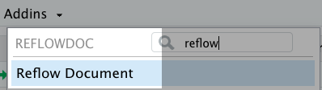

<!-- README.md is generated from README.Rmd. Please edit that file -->

# reflowdoc 

[](https://www.tidyverse.org/lifecycle/#experimental)

An Rstudio add-in for hard wrapping non-code chunk text areas in
Rmarkdown documents to a margin/width of 80.

## Installation

Install the from Github with the
[**{{remotes}}**](https://github.com/r-lib/remotes) package.

``` r
## install pkg from Github
remotes::install_github("mkearney/reflowdoc")
```

## Use

To reflow your current \[active\] document, click the `Addins v`
dropdown in Rstudio and select `Reflow Document` (you may need to
restart Rstudio after install for this to appear).

<p style="text-align:center">



</p>
